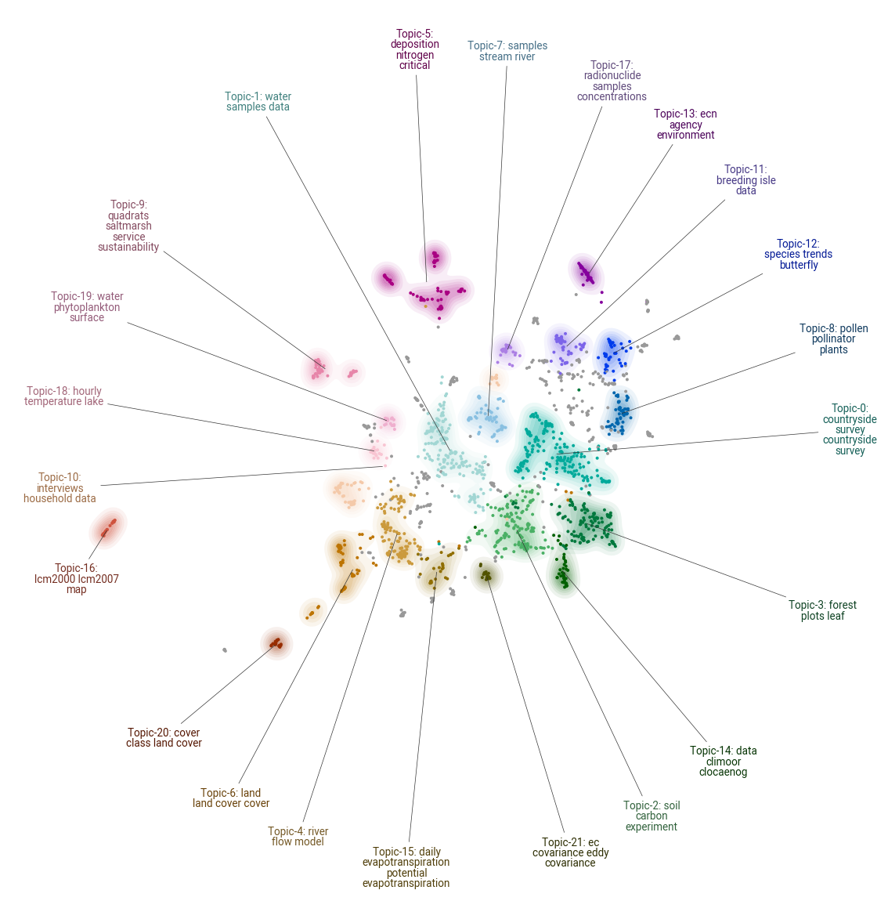

# BERTopic

[BERTopic](https://maartengr.github.io/BERTopic/index.html) is a topic modelling library that can be easily applied using python. This page contains results of using the library with the NERC EIDC metadata title, descriptions and lineage data.

## Documents topic map.
A visualisation of the `1800` documents (dataset titles, descriptions and lineage information) available in the EIDC can be seen below. The visualisation takes the embeddings for each document and appluies `UMAP` to reduce the dimensionality. BERTopic then applies clustering (here using a minumum cluster size of `20`) and then the visualisation color codes and labels the clusters. The labelling applies the keybert model to generate the descriptive words in the labels. The code used to generate this model and visualisation can be found here: [`create_bert_topic_model.py`](https://github.com/NERC-CEH/discoverability/blob/topic_modelling/topic_modelling/create_bert_topic_model.py)

